---

> ### Summary
> 
> **Problem.** Margo PR1 supports two deployment profiles — Helm (Kubernetes) and Compose (Docker/Podman) — but thousands of resource-constrained edge devices in industrial environments lack the RAM, CPU, or operational overhead budget to run either runtime. These devices sit below Margo's current reach, leaving the most numerous tier of the factory floor without a standards-based application deployment path.
> 
> **Proposal.** Add Podman Quadlets as a third deployment profile type (`quadlet.v1`). Quadlet files are lightweight, INI-style descriptors that run OCI containers directly under systemd — the init system already present on every Linux device. They require no additional orchestrator, no daemon, and no new registry infrastructure. The same OCI images used by Helm and Compose profiles are reused unchanged.
> 
> **Key findings.** Quadlets provide native systemd security (seccomp, SELinux, cgroups v2) by default, offer a direct path to WebAssembly workloads via crun, and can be converted to and from Compose files. The estimated specification change complexity is low, with zero impact on Margo's existing APIs, registries, or observability model. A working demo is included below.
> 
> **Conclusion.** Margo's specification architecture is deployment-profile-agnostic by design. Quadlet support exploits this design with a localized, low-risk addition that extends Margo compliance down to 256 MB RAM devices — unlocking DIN-rail gateways, compact controllers, and single-board computers for the industrial edge ecosystem. The change maybe be compatible with the GA1 timeline.

---

## The Opportunity

Margo PR1 defines two deployment profile types: **Helm v3** for Kubernetes-based standalone cluster devices and **Compose** for standalone devices running Docker or Podman. These cover an enormous range of use cases, and the spec wisely keeps the door open for future profile types — the FAQ explicitly lists "proprietary runtime environments, WASM" as candidates for future releases.

There is a third option hiding in plain sight. It requires no new runtime, no new registry infrastructure, and no new distribution mechanism. It runs on every Linux system with systemd. It is already part of the Podman ecosystem that Margo recognizes as a Compose-compliant engine. And it may be the simplest possible way to get an application running on a resource-constrained edge device.

That option is **Podman Quadlets**.

### One Application, Three Profiles, Every Device

```mermaid
flowchart TB
    subgraph REG ["OCI Registry (shared by all profiles)"]
        OCI["oci://registry.example.com/margo/sensor-gateway:1.2.0"]
    end

    AD["📦 Margo ApplicationDescription<br>(margo.yaml)"]

    AD -->|"deploymentProfile:<br>helm.v3"| HELM["⎈ Helm Chart<br>(Chart.yaml + templates/)"]
    AD -->|"deploymentProfile:<br>compose"| COMP["🐳 Compose Archive<br>(compose.yaml + .tar.gz)"]
    AD -->|"deploymentProfile:<br>quadlet.v1"| QUAD["🦭 Quadlet Archive<br>(.container + .volume + .tar.gz)"]

    HELM -->|pull images| OCI
    COMP -->|pull images| OCI
    QUAD -->|pull images| OCI

    HELM --> K8S["Standalone Cluster<br>Kubernetes · 4+ GB RAM"]
    COMP --> DOCK["Standalone Device<br>Docker/Podman · 1-4 GB RAM"]
    QUAD --> SYSD["Lightweight Standalone<br>systemd · 256 MB-1 GB RAM"]

    style QUAD fill:#892CA0,color:#fff,stroke:#6A1B7A
    style SYSD fill:#892CA0,color:#fff,stroke:#6A1B7A
    style HELM fill:#0F1689,color:#fff
    style K8S fill:#0F1689,color:#fff
    style COMP fill:#2496ED,color:#fff
    style DOCK fill:#2496ED,color:#fff
    style OCI fill:#FF9800,color:#fff
    style AD fill:#37474F,color:#fff
```



All three profiles pull the same OCI images from the same registries. The ApplicationDescription lists which profiles are available. A Margo-compliant device picks the one that matches its role.

---

## What Is a Quadlet?

A Quadlet is a declarative unit file that tells Podman how to run a container, volume, network, or pod under systemd. Quadlet files use the familiar INI-style syntax of systemd unit files, extended with a `[Container]` (or `[Volume]`, `[Network]`, `[Pod]`) section for container-specific options. At boot time — or whenever `systemctl daemon-reload` runs — the Podman systemd generator reads these files and produces standard `.service` units automatically.

The original Quadlet repository described it this way: *"What do you get if you squash a Kubernetes kubelet? A quadlet."* It was created by Alex Larsson (Red Hat) and merged into Podman starting with version 4.4 (2023). It is now the recommended way to run Podman containers under systemd, replacing the deprecated `podman generate systemd` command.

### A Side-by-Side Comparison

**Compose file** (`compose.yaml`, 17 lines):

```yaml
services:
  sensor-gateway:
    image: oci.example.com/margo/sensor-gateway:1.2.0
    ports:
      - "1883:1883"
    environment:
      - MQTT_BROKER=localhost
      - LOG_LEVEL=info
    volumes:
      - sensor-data:/data
    restart: always
    deploy:
      resources:
        limits:
          cpus: "0.5"
          memory: 256M

volumes:
  sensor-data:
```

**Quadlet file** (`sensor-gateway.container`, 16 lines):

```ini
[Unit]
Description=Margo Sensor Gateway

[Container]
Image=oci.example.com/margo/sensor-gateway:1.2.0
PublishPort=1883:1883
Environment=MQTT_BROKER=localhost
Environment=LOG_LEVEL=info
Volume=sensor-data.volume:/data
AutoUpdate=registry

[Service]
Restart=always
CPUQuota=50%
MemoryMax=256M

[Install]
WantedBy=default.target
```

And a companion volume file (`sensor-data.volume`, 3 lines):

```ini
[Volume]
Label=app=sensor-gateway
```

The line counts are similar, but the Quadlet version gains something significant: `CPUQuota=50%` and `MemoryMax=256M` are native systemd resource controls enforced through cgroups v2. The `AutoUpdate=registry` directive enables Podman's built-in image update mechanism. And the `[Install]` section is pure systemd — the service starts at boot, respects dependency ordering, and integrates with `journalctl` for logging.

---

## Why Quadlets Fit the Margo Model

### 1\. Same OCI Distribution, Zero Infrastructure Changes

Quadlet files reference standard OCI container images pulled from standard OCI registries. This is exactly the same infrastructure Margo already requires for Helm charts and Compose archives. A Quadlet-based Margo component would point to the same `oci://` repository URL that a Compose or Helm component uses today.

The Quadlet files themselves — plain text `.container`, `.volume`, `.network` files — can be distributed as a simple tarball archive (a "Quadlet Archive"), analogous to how Margo currently defines Compose Archives as tarballs containing `compose.yaml` plus supporting files. This means **no changes to Margo's existing registry or distribution infrastructure are needed**.

### 2\. Native systemd Integration Means Native Security


> **📊 Companion visualization** provides a detailed layered diagram spec showing the full cascade from a 16-line Quadlet file down through Podman generator, systemd, kernel security mechanisms, and user namespaces.

When Podman generates a systemd service from a Quadlet, the resulting service inherits the full security stack of a modern Linux system:

* **Seccomp filtering** is enabled by default (Podman applies `/usr/share/containers/seccomp.json`)
    
* **SELinux / AppArmor** confinement is applied automatically
    
* **Capabilities** are dropped to a minimal set (e.g., `CAP_CHOWN`, `CAP_NET_BIND_SERVICE`, `CAP_SETUID` — no `CAP_SYS_ADMIN`)
    
* **Rootless execution** is a first-class option — the container runs under an unprivileged user with user namespace remapping
    
* `NoNewPrivileges` is enabled by default, preventing setuid escalation
    

Resource limits are applied through the systemd `[Service]` section using standard cgroups v2 directives:

```ini
[Service]
CPUQuota=50%
MemoryMax=256M
IOReadBandwidthMax=/dev/sda 10M
TasksMax=64
```

These are not Podman-specific flags — they are the same controls any systemd service can use, auditable with standard Linux tools (`systemctl show`, `systemd-cgtop`). For OT environments where security auditors need to verify resource isolation, this is a significant advantage: the enforcement mechanism is the OS itself.

### 3\. Technology-Agnostic by Design

The Quadlet file is a thin declarative layer on top of standard OCI infrastructure. It specifies **what** to run (an OCI image), **how** to configure it (environment, ports, volumes), and **where** to hook into the system (systemd dependencies). It does not dictate what happens inside the container or what runtime executes it.

This means Quadlet files are convertible:

* **From Compose → Quadlet**: The [`podlet`](https://github.com/containers/podlet) tool converts Docker Compose files to Quadlet files automatically.
    
* **From Quadlet → Compose**: Since Quadlet files are simple INI with well-defined keys, a reverse conversion tool is straightforward to build. The OCI images remain the same.
    
* **From Quadlet → Kubernetes**: Podman supports `.kube` Quadlet files that reference Kubernetes YAML directly. The same OCI images deploy to both single-node Quadlet setups and multi-node Kubernetes clusters.
    

The Quadlet file shields the Margo specification from runtime-specific details. Whether the underlying system uses crun, runc, or a WASM runtime — the Quadlet file looks the same.

### 4\. A Direct Path to WebAssembly

Podman's OCI runtime, **crun**, has built-in support for WebAssembly via WasmEdge, Wasmtime, and Wasmer. When crun detects that an OCI image contains a WASM binary (via the `module.wasm.image/variant=compat` annotation), it delegates execution to the appropriate WASM runtime instead of setting up a Linux container namespace.


The WASM binary is packaged as a standard OCI image, stored in a standard OCI registry, and pulled by Podman like any other image. Margo's registry infrastructure, signing mechanisms, and application description format work without modification.

The Margo FAQ already identifies WASM as a future deployment target. Quadlets provide a concrete, working path to get there **using the infrastructure Margo has already defined**.

### 5\. Simplicity as an Adoption Accelerator


> **📊 Companion visualization** provides a detailed pyramid diagram spec mapping deployment profiles to device tiers, hardware requirements, example hardware, and typical device counts per factory site.

Consider the minimal requirements for each Margo deployment profile on a standalone edge device:

| Requirement | Helm v3 | Compose | Quadlet |
| --- | --- | --- | --- |
| Container Runtime | containerd + kubelet | Podman or Docker | Podman |
| Orchestrator | Kubernetes (K3s, MicroShift) | Docker Compose / Podman Compose | systemd (already present) |
| Package Manager | Helm CLI | — | — |
| Init System Integration | Needs a service wrapper | Needs a service wrapper | **Native** |
| Minimum RAM Overhead | ~1024 MB (K3s) | ~256 MB (daemon) | **~0 MB** (daemonless) |

Podman is daemonless. Quadlets are consumed by a systemd generator that is already running.

---

## Specification Change Complexity Assessment

With Margo targeting GA1, timing matters. The following analysis breaks down exactly what would need to change in the specification to support Quadlet as a third deployment profile type, and — equally important — what would not need to change.

### What Changes

| Spec Area | Change Required | Effort |
| --- | --- | --- |
| `deploymentProfiles.type` enum | Add `quadlet.v1` alongside `helm.v3` and `compose` | 🟡 One line |
| ApplicationDescription properties | Define `packageLocation` semantics for Quadlet Archives | 🟡 ~1 page; mirrors Compose Archive |
| Application Package definition | Add "Quadlet Archive" as packaging option + PGP signing | 🟡 ~1 page; reuses Compose pattern |
| Device role mapping | Standalone devices MAY support Quadlet | 🟡 One paragraph |
| WFM Agent reconciliation | Unpack → write to systemd dir → `daemon-reload` → `start`/`stop` | 🟡 ~2 pages; simpler than Helm/Compose |
| Sandbox / reference impl. | Add Quadlet-based standalone device example | 🟡 Moderate; prototype in days |

### What Does NOT Change

| Spec Area | Why No Change Needed |
| --- | --- |
| ✅ OCI image format and registries | Quadlets pull the same OCI images from the same registries |
| ✅ Application Registry (Git) | Quadlet Archives referenced by URL, same as Compose |
| ✅ Component Registry | OCI registries serve both container images and Quadlet-referenced images |
| ✅ Desired State API | `ApplicationDeployment` YAML is profile-agnostic; `type: quadlet.v1` needs no API change |
| ✅ Deployment Status API | Status reporting (installed, running, failed) identical across profiles |
| ✅ Observability (OpenTelemetry) | OTEL collectors and env var injection work identically |
| ✅ Digital signing and verification | PGP signing of Quadlet Archives follows Compose Archive pattern |
| ✅ Parameter injection | `Environment=` directives in Quadlet map from ApplicationDeployment params |

### Specification Impact Summary

The core specification architecture — registries, desired state, deployment status, observability — is **deployment-profile-agnostic by design**. This is one of the specification's greatest strengths. Adding a Quadlet profile exploits this design: it is a localized change to the application packaging and device role sections, with no ripple effects on APIs, security models, or management interfaces.

The total specification text change is estimated at **4-6 pages**, comparable in scope to a Category 2 Specification Enhancement Request. Because the Quadlet Archive pattern directly mirrors the existing Compose Archive pattern, much of the text can be adapted rather than written from scratch.

---

## How This Maps to Margo's Application Description

A Quadlet deployment profile would slot into the existing ApplicationDescription structure naturally:

```yaml
apiVersion: margo.org/v1-alpha1
kind: ApplicationDescription
metadata:
  name: Sensor Gateway
  version: 1.2.0
deploymentProfiles:
  - type: helm.v3
    id: sensor-gateway-helm
    components:
      - name: sensor-gateway-chart
        properties:
          repository: oci://registry.example.com/charts/sensor-gateway
          revision: 1.2.0
  - type: compose
    id: sensor-gateway-compose
    components:
      - name: sensor-gateway-compose
        properties:
          packageLocation: https://registry.example.com/compose/sensor-gateway-1.2.0.tar.gz
  - type: quadlet.v1            # New deployment profile type
    id: sensor-gateway-quadlet
    components:
      - name: sensor-gateway-quadlet
        properties:
          packageLocation: https://registry.example.com/quadlet/sensor-gateway-1.2.0.tar.gz
```

The `packageLocation` points to a tarball containing the `.container`, `.volume`, and `.network` files — exactly the same distribution pattern as Compose Archives. The Workload Fleet Management Agent would unpack these files into the appropriate systemd directory and run `systemctl daemon-reload`.

---

## Hands-On Resources and Code Samples

All code examples, configuration files, and measurement scripts referenced in this article are available in a companion GitHub repository with complete, reproducible tutorials:

**📦 GitHub Repository**: [podman-wasm-oci](https://github.com/javatask/podman-wasm-oci-example)

### Quick Start

Clone the repository and run any example:

```bash
# Clone the repository
git clone https://github.com/javatask/podman-wasm-oci-example
cd podman-wasm-oci-example

# Follow the Tutorial instructions
cat tutorial.md
```

---

## Closing Thoughts

Margo's power lies in its abstraction: define an application once, deploy it anywhere on compliant devices. PR1 rightly started with Helm and Compose — the two most widely adopted container deployment patterns. But the industrial edge is vast, and many devices at its far reaches do not run Kubernetes and do not need a Compose daemon.

Podman Quadlets offer a deployment profile that is native to the Linux init system, secured by default, trivial to distribute, and forward-compatible with WebAssembly workloads — all without requiring a single change to Margo's existing OCI-based registry and distribution architecture.

The building blocks are already in place. The question is simply whether we formalize them.

---

## Next Steps

We invite the Margo community to:

1. **Try the example** above and share your experience on the Margo Discourse forum.
    
2. **Review the complexity assessment** and tell us if we missed anything.
    

*Discussion and feedback:* [*Margo Discourse forum*](https://discourse.margo.org/) *·* [*Specification GitHub*](https://github.com/margo/specification)